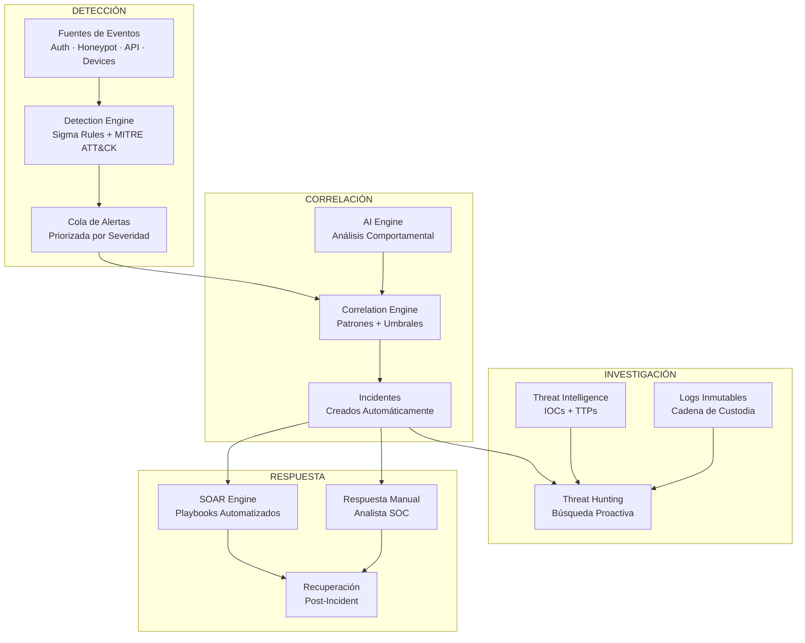
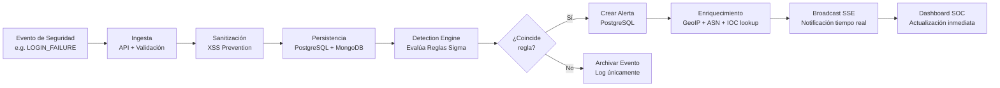
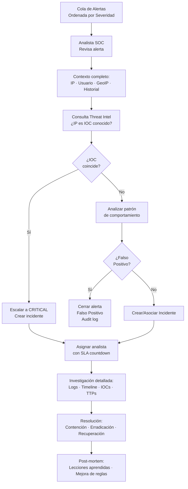
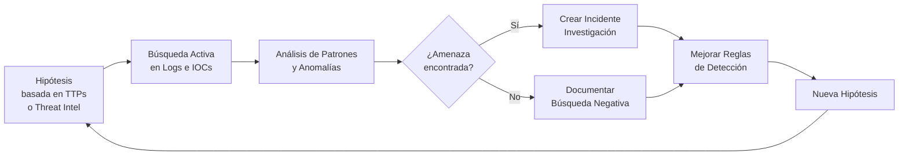
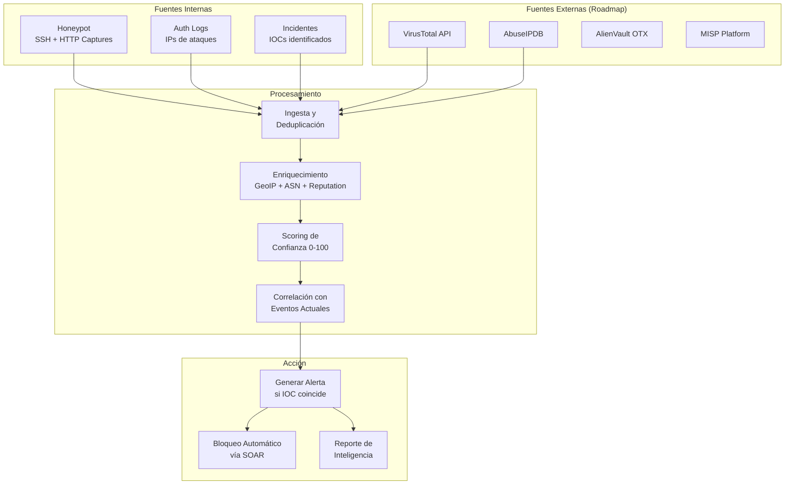
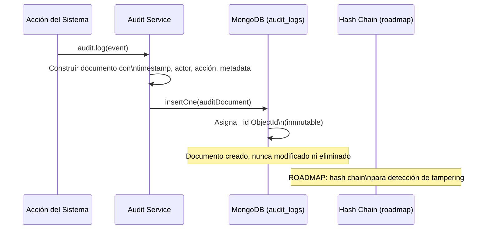

# Operaciones SOC — RobenGate Sentinel

**Autor:** SOC Director + Principal Cybersecurity Architect  
**Versión:** 2.0.0  
**Fecha:** Junio 2026  
**Framework:** NIST CSF, MITRE ATT&CK, ISO/IEC 27035

---

## 1. Visión General del SOC

### Definición

El Security Operations Center (SOC) de RobenGate Sentinel es el núcleo operativo de la plataforma. Proporciona capacidades de detección, correlación, investigación, respuesta y threat hunting centralizadas en una única interfaz de operaciones.

### Modelo de Operaciones SOC



---

## 2. Workflow de Detección

### 2.1 Pipeline de Detección



### 2.2 Reglas de Detección Sigma Implementadas

| ID Regla | Nombre | Técnica MITRE | Severidad | Umbral |
|---|---|---|---|---|
| rule-brute-force-001 | SSH/Web Brute Force | T1110.001 | HIGH | ≥5 fallos / 10 min / IP |
| rule-credential-spray-001 | Credential Spraying | T1110.003 | HIGH | ≥10 fallos / 5+ usuarios / 15 min |
| rule-honeypot-scan-001 | Port/Service Scan | T1046 | MEDIUM | ≥3 hits honeypot / 5 min / IP |
| rule-multi-vector-001 | Multi-Vector Attack | TA0001 | CRITICAL | Honeypot + Brute Force + Threat / 30 min |
| rule-privilege-escalation-001 | Privilege Escalation | T1068 | CRITICAL | Role change a admin |
| rule-account-enum-001 | Account Enumeration | T1087 | MEDIUM | Múltiples usuarios no existentes |
| rule-impossible-travel-001 | Impossible Travel | T1078 | HIGH | Login de 2 países en <2h |
| rule-session-anomaly-001 | Session Anomaly | T1563 | MEDIUM | User agent mismatch |
| rule-api-abuse-001 | API Rate Abuse | T1499.003 | MEDIUM | ≥100 req/min API |
| rule-banned-ip-attempt-001 | Banned IP Attempt | T1071 | HIGH | Login desde IP baneada |
| rule-admin-access-offhours-001 | Admin Access Off-Hours | T1078.002 | MEDIUM | Admin login 00:00-06:00 |
| rule-concurrent-session-001 | Concurrent Sessions | T1563.002 | MEDIUM | Misma cuenta, 2 IPs simultáneas |

### 2.3 Cobertura MITRE ATT&CK

```
Tácticas cubiertas (12/14):
✅ TA0001 — Initial Access
✅ TA0002 — Execution  
✅ TA0003 — Persistence
✅ TA0004 — Privilege Escalation
✅ TA0005 — Defense Evasion
✅ TA0006 — Credential Access
✅ TA0007 — Discovery
❌ TA0008 — Lateral Movement (roadmap)
✅ TA0009 — Collection
✅ TA0010 — Exfiltration
✅ TA0011 — Command and Control
✅ TA0040 — Impact
```

---

## 3. Workflow de Correlación

### 3.1 Motor de Correlación Automática

El Correlation Engine evalúa continuamente los eventos recientes para detectar patrones que indiquen ataques coordinados o campañas de amenaza.

```mermaid
flowchart TD
    Event[Nuevo Evento] --> Query[Query: eventos recientes\npor IP y tipo]
    Query --> Rules{Evalúa 4\nReglas de Correlación}
    
    Rules -->|BRUTE_FORCE| BF[≥5 LOGIN_FAILURE\nmisma IP / 10 min]
    Rules -->|CREDENTIAL_SPRAY| CS[≥10 fallos\n≥5 usuarios distintos / 15 min]
    Rules -->|HONEYPOT_SWEEP| HS[≥3 hits honeypot\nmisma IP / 5 min]
    Rules -->|MULTI_VECTOR| MV[Honeypot + Login Failure\n+ Threat / misma IP / 30 min]
    
    BF --> Cooldown{¿Cooldown\nactivo?}
    CS --> Cooldown
    HS --> Cooldown
    MV --> Cooldown
    
    Cooldown -->|Sí| Skip[No crear incidente\n(evitar duplicados)]
    Cooldown -->|No| CreateIncident[INSERT incidents\nstatus=new, tlp=RED]
    
    CreateIncident --> CreateEvent[INSERT incident_events\n(auto-detected)]
    CreateEvent --> SOAR[Evalúa Playbooks\nSOAR Engine]
    CreateEvent --> SSE[Broadcast SSE\nNotificación SOC]
    
    SOAR --> PlaybookMatch{¿Playbook\ncoincide?}
    PlaybookMatch -->|Sí| ExecuteActions[Ejecutar Acciones\n(ban IP, disable user, etc.)]
    PlaybookMatch -->|No| WaitAnalyst[Esperar intervención\nde analista]
```

### 3.2 Correlación IA (AI Correlation Engine)

El AI Correlation Engine añade una capa de análisis estadístico que detecta anomalías comportamentales no cubiertas por reglas estáticas.

**Análisis realizados:**
- Baseline de comportamiento por usuario (horarios típicos de login, IPs habituales, países)
- Z-score: desviación del comportamiento respecto al baseline personal
- Impossible travel: distancia geográfica / tiempo transcurrido → velocidad imposible
- Feature extraction: 15+ señales normalizadas para clasificación
- Scoring de anomalía: 0-100 por usuario y sesión

**Ejemplo: Impossible Travel Detection**
```
Usuario: ana@company.com
Login 1: 09:00 UTC — Madrid, España (IP: 88.24.x.x)
Login 2: 09:45 UTC — São Paulo, Brasil (IP: 189.6.x.x)

Distancia: 9,400 km
Tiempo transcurrido: 45 minutos
Velocidad requerida: 12,500 km/h (imposible)

→ Anomaly Score: 95/100
→ Alerta: CRITICAL — Impossible Travel Detected
→ Acción: Requiere re-autenticación WebAuthn
```

---

## 4. Workflow de Investigación

### 4.1 Flujo de Investigación de Alertas



### 4.2 Investigación de Incidentes — Fases

#### Fase 1: Detección y Triaje (0-15 minutos)
- **Objetivo:** Confirmar que el incidente es real y evaluar severidad inicial
- **Herramientas:** Dashboard SOC, Cola de alertas, Correlation Engine
- **Acciones:**
  1. Revisar la alerta con contexto completo (IP, usuario, evento tipo, hora)
  2. Comprobar si la IP está en Threat Intelligence (IOC lookup)
  3. Revisar historial del usuario: ¿comportamiento anómalo reciente?
  4. Confirmar o descartar falso positivo
  5. Asignar severidad: Critical / High / Medium / Low

#### Fase 2: Contención (15-60 minutos)
- **Objetivo:** Limitar el impacto del incidente
- **Acciones SOAR disponibles:**
  - `ban_ip`: Banear IP atacante (duración configurable)
  - `disable_account`: Suspender cuenta comprometida
  - `revoke_user_sessions`: Invalidar todas las sesiones JWT del usuario
  - `isolate_endpoint`: Aislar dispositivo comprometido (EDR integration)
  - `notify_webhook`: Alertar canales externos (Slack, PagerDuty, Teams)

#### Fase 3: Erradicación (1-24 horas)
- **Objetivo:** Eliminar la causa raíz del incidente
- **Acciones:**
  1. Identificar el vector de entrada
  2. Parchear la vulnerabilidad o cambiar credenciales comprometidas
  3. Revisar logs completos del período afectado
  4. Verificar integridad de datos afectados
  5. Añadir IOCs a Threat Intelligence

#### Fase 4: Recuperación (24-72 horas)
- **Objetivo:** Restaurar operaciones normales
- **Acciones:**
  1. Restaurar accesos suspendidos tras verificación
  2. Monitorizar activamente el sistema restaurado
  3. Confirmar que no hay persistencia del atacante
  4. Actualizar documentación de incidente

#### Fase 5: Post-Mortem (1 semana)
- **Objetivo:** Aprender y mejorar defensas
- **Acciones:**
  1. Documentar timeline completo del incidente
  2. Identificar gaps de detección
  3. Crear/actualizar reglas Sigma si es necesario
  4. Actualizar playbooks SOAR basado en lo aprendido
  5. Compartir lecciones con el equipo

---

## 5. Workflow de Threat Hunting

### 5.1 Metodología de Threat Hunting



### 5.2 Queries de Threat Hunting (Ejemplos)

#### Hunt 1: Detección de Persistence via Admin Account Creation
```sql
-- Buscar creaciones de usuarios admin fuera de horario laboral
SELECT u.email, u.created_at, sl.ip_address, sl.metadata
FROM security_logs sl
JOIN users u ON (sl.metadata->>'target_user_id')::int = u.id
WHERE sl.event_type = 'USER_CREATED'
  AND u.role = 'admin'
  AND (EXTRACT(HOUR FROM sl.created_at) < 8 
       OR EXTRACT(HOUR FROM sl.created_at) > 20)
  AND sl.created_at > NOW() - INTERVAL '30 days'
ORDER BY sl.created_at DESC;
```

#### Hunt 2: Detección de Lateral Movement via Session Patterns
```sql
-- Múltiples sesiones activas desde diferentes IPs para mismo usuario
SELECT user_id, COUNT(DISTINCT ip_address) as ip_count,
       array_agg(DISTINCT ip_address) as ips,
       COUNT(*) as session_count
FROM sessions
WHERE created_at > NOW() - INTERVAL '1 hour'
  AND expires_at > NOW()
GROUP BY user_id
HAVING COUNT(DISTINCT ip_address) > 2
ORDER BY ip_count DESC;
```

#### Hunt 3: Detección de Exfiltration via API Rate Anomaly
```sql
-- IPs con consumo de API anormalmente alto
SELECT ip_address, 
       COUNT(*) as requests,
       COUNT(DISTINCT endpoint) as unique_endpoints,
       array_agg(DISTINCT endpoint) as endpoints_accessed
FROM api_logs  
WHERE created_at > NOW() - INTERVAL '1 hour'
GROUP BY ip_address
HAVING COUNT(*) > 500 
   AND COUNT(DISTINCT endpoint) > 10
ORDER BY requests DESC;
```

---

## 6. Workflow de Threat Intelligence

### 6.1 Ciclo de Vida de la Inteligencia de Amenazas



### 6.2 Tipos de IOCs Soportados

| Tipo | Ejemplo | Uso en Detección |
|---|---|---|
| IP | 185.220.101.45 | Comparación con ip_address en eventos |
| CIDR Range | 185.220.0.0/16 | Coincidencia de rango de red |
| Dominio | malware-c2.evil.com | DNS queries + HTTP host headers |
| Hash MD5/SHA256 | d41d8cd98f00b204... | Integridad de ficheros (roadmap) |
| Email | phishing@evil.com | Correlación con intentos de auth |
| URL | http://evil.com/payload | Análisis de request paths |
| ASN | AS12345 | Agrupación por proveedor de red |

### 6.3 Scoring de Indicadores

| Confianza | Rango | Criterio | Acción por Defecto |
|---|---|---|---|
| Critical | 90-100 | Honeypot confirmado + fuentes múltiples | Ban automático vía SOAR |
| High | 70-89 | Una fuente confiable + comportamiento sospechoso | Alerta HIGH + watchlist |
| Medium | 40-69 | Fuente única, no confirmado | Alerting únicamente |
| Low | 1-39 | Sospechoso pero sin confirmación | Logging para análisis |

---

## 7. Workflow de Audit Trail

### 7.1 Inmutabilidad del Audit Log

El audit log de RobenGate Sentinel está diseñado para ser legalmente admisible como evidencia forense.

**Garantías de inmutabilidad:**
1. Almacenado en MongoDB — sin método `update()` ni `delete()` en el modelo
2. Sin endpoint DELETE en la API (ninguna ruta expone DELETE sobre audit_logs)
3. El único mecanismo de eliminación es TTL automático (365 días mínimo)
4. Los cambios no pasan por el audit log — el audit log solo tiene operaciones INSERT
5. Estructura de documento append-only: nuevo documento por cada evento

### 7.2 Eventos Auditados

| Categoría | Eventos |
|---|---|
| Autenticación | LOGIN_SUCCESS, LOGIN_FAILURE, LOGOUT, MFA_ENABLED, MFA_DISABLED, WEBAUTHN_REGISTERED |
| Usuarios | USER_CREATED, USER_UPDATED, USER_DELETED, ROLE_CHANGED, ACCOUNT_DISABLED |
| Acceso denegado | ACCESS_DENIED (todas las rutas con 403) |
| Incidentes | INCIDENT_CREATED, INCIDENT_UPDATED, INCIDENT_CLOSED, INCIDENT_ESCALATED |
| Alertas | ALERT_ACKNOWLEDGED, ALERT_RESOLVED, ALERT_ESCALATED |
| SOAR | PLAYBOOK_EXECUTED, IP_BANNED, ACCOUNT_DISABLED_AUTO, SESSION_REVOKED |
| Sistema | BACKUP_COMPLETED, CONFIG_CHANGED, API_KEY_CREATED, API_KEY_REVOKED |

### 7.3 Estructura de Registro de Audit



---

## 8. KPIs y Métricas SOC

### Métricas Operacionales

| Métrica | Descripción | Objetivo | Cómo Medir |
|---|---|---|---|
| MTTD | Mean Time to Detect | < 5 minutos | Tiempo entre evento y creación de alerta |
| MTTR | Mean Time to Respond | < 30 minutos (SOAR) / < 4h (manual) | Tiempo entre incidente creado y resuelto |
| Alert Fatigue Rate | % alertas que son falsos positivos | < 10% | Alertas cerradas como FP / total alertas |
| Playbook Execution Rate | % incidentes manejados por SOAR | > 60% | Incidentes SOAR / total incidentes |
| SLA Compliance | % incidentes resueltos dentro del SLA | > 95% | Incidentes en SLA / total |

### Dashboard de Métricas SOC

El dashboard principal de RobenGate Sentinel muestra en tiempo real:
- **Risk Score Global** de la organización (0-100)
- **Alertas activas** por severidad (Critical / High / Medium / Low)
- **Incidentes abiertos** con tiempo de apertura
- **Eventos en 24h** con gráfico de tendencia
- **Top IPs atacantes** con geolocalización
- **Top tácticas MITRE ATT&CK** detectadas en el período
- **Honeypot activity** — capturas activas

---

## 9. Estructura del Equipo SOC

### Roles en RobenGate Sentinel

| Rol RBAC | Responsabilidades | Accesos |
|---|---|---|
| **Admin** | Gestión de la plataforma, usuarios, RBAC, playbooks, configuración | Todo: lectura + escritura + configuración |
| **Analyst** | Investigación de incidentes, threat hunting, gestión de alertas | Todos los módulos SOC: lectura + escritura |
| **Responder** | Primera respuesta a alertas, contención básica | Alertas, incidentes (lectura + acciones básicas) |
| **Viewer** | Monitorización, reporting, dashboard | Todos los módulos: solo lectura |

### Flujo de Escalación

```mermaid
flowchart TD
    Alert[Alerta Generada\npor el Sistema] --> Viewer[Viewer\nMonitorización] 
    Viewer --> Responder[Responder\nPrimera Respuesta]
    Responder --> Contain[Contención Básica\n(acciones SOAR disponibles)]
    Contain --> Analyst[Analyst\nInvestigación Profunda]
    Analyst --> Admin[Admin\nDecisión Final + Configuración]
    Admin --> Close[Cierre del Incidente\nPost-mortem]
```

---

*Documento generado por: SOC Director + Principal Cybersecurity Architect*  
*RobenGate Sentinel v2.0.0 — Junio 2026*
