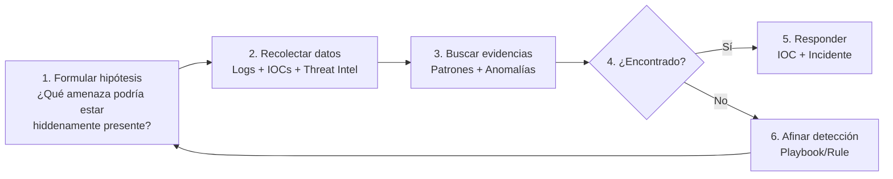

# Guía SOC — Threat Hunting

**Rol requerido:** `analyst`  
**Módulo:** Threat Hunting / Search  

---

## ¿Qué es Threat Hunting?

El threat hunting es la búsqueda **proactiva** de amenazas que pueden haber eludido los controles de detección automática. A diferencia del triaje de alertas (reactivo), el hunting busca indicadores de compromiso de forma sistemática.

---

## Metodología de Hunting



---

## Hipótesis de Hunting — Plantillas

### H1: Credential Stuffing en progreso

**Hipótesis:** Un actor está usando credenciales filtradas de una brecha conocida para comprometer cuentas.

**Búsqueda:**
```bash
# Múltiples fallos de login desde IPs distribuidas en ventana corta
GET /api/search/analytics?aggregation=by_ip&from=<2h_ago>&limit=50

# Buscar IPs con pattern: pocos intentos pero muchas cuentas diferentes
GET /api/logs?event_type=LOGIN_FAILED&from=<1h_ago>&limit=500
# Analizar: ¿Cuántas cuentas distintas prueba cada IP?

# Cruzar con éxitos
GET /api/logs?event_type=LOGIN_SUCCESS&from=<1h_ago>
# ¿Hay éxitos de IPs con muchos fallos previos?
```

**Indicadores positivos:**
- IP prueba 10+ cuentas distintas en 15 minutos
- User-agent cambia entre intentos desde misma IP
- IPs distribuidas geográficamente con mismo patrón temporal
- Éxitos de login coinciden temporalmente con el ataque

---

### H2: Reconocimiento de infraestructura

**Hipótesis:** Un actor está mapeando la infraestructura antes de un ataque.

**Búsqueda:**
```bash
# Buscar sondeos HTTP a rutas sensibles
GET /api/honeypot/events?type=http&limit=100
# Revisar paths: /.env, /wp-admin, /admin, /api, /.git

# Buscar Port scanning patterns
GET /api/logs?event_type=PORT_SCAN_DETECTED

# IPs con muchas rutas 404 en corto tiempo
GET /api/search/analytics?aggregation=by_ip
```

**Indicadores positivos:**
- Secuencia de rutas conocida de scanners (nikto, nuclei, dirbuster)
- Múltiples 404 seguidos de exploits específicos
- El honeypot SSH recibe auth intentos + HTTP recibe sondeos desde misma IP

---

### H3: Movimiento lateral post-compromiso

**Hipótesis:** Un actor que ya comprometió una cuenta está pivotando a otras.

**Búsqueda:**
```bash
# Cuentas que accedieron a módulos inusuales
GET /api/audit?category=ACCESS&from=<24h_ago>
# Buscar: ¿Algún viewer intentó acceder a endpoints de admin?

# Login desde múltiples IPs en corto tiempo
GET /api/logs?event_type=LOGIN_SUCCESS&from=<24h_ago>
# Cruzar user_id con múltiples IPs distintas

# Cambios de configuración inusuales
GET /api/audit?category=ADMIN&from=<24h_ago>
```

**Indicadores positivos:**
- Mismo usuario, dos países en < 2 horas (impossible travel)
- Múltiples LOGIN_SUCCESS de IP nunca vista para ese usuario
- Accesos a módulos fuera del patrón normal del usuario

---

### H4: Data Exfiltration

**Hipótesis:** Un actor (interno o externo) está extrayendo datos.

**Búsqueda:**
```bash
# Exportaciones masivas de audit logs
GET /api/audit?action=AUDIT_EXPORT&from=<week_ago>

# Búsquedas inusuales en el sistema
GET /api/audit?category=DATA&from=<24h_ago>

# Requests con payloads grandes (exfiltration via SQL OUT)
GET /api/logs?event_type=SQL_INJECTION_ATTEMPT&from=<week_ago>
# metadata.payload — buscar UNION SELECT, INTO OUTFILE, xp_cmdshell
```

---

### H5: APT — Persistencia

**Hipótesis:** Un actor persistente ha comprometido credenciales admin y ha creado backdoors.

**Búsqueda:**
```bash
# Nuevas credenciales WebAuthn registradas recientemente
GET /api/audit?action=WEBAUTHN_REGISTERED&from=<week_ago>

# Cambios de contraseña inesperados
GET /api/audit?action=PASSWORD_CHANGED&from=<week_ago>

# Nuevos administradores creados
GET /api/audit?action=USER_ROLE_CHANGED&category=ADMIN
# Buscar: ¿Alguien fue promovido a admin?

# API Keys creadas recientemente
GET /api/audit?action=API_KEY_CREATED
```

---

## Búsquedas Avanzadas — Elasticsearch

Con Elasticsearch disponible, usar queries más potentes:

```bash
# Buscar texto libre — payloads SQLi conocidos
GET /api/search/logs?q=union+select+from&severity=critical

# Buscar user agents de herramientas
GET /api/search/logs?q=sqlmap+OR+nuclei+OR+nmap

# Buscar intentos de explotación de CVEs específicos
GET /api/search/logs?q=CVE-2024-3400+OR+GlobalProtect

# Buscar callbacks C2 conocidos
GET /api/search/logs?q=cobalt+strike+OR+metasploit
```

---

## Analizar Comportamiento con AI Module

```bash
# Vista general de anomalías detectadas
GET /api/ai/overview

# Stream de anomalías recientes
GET /api/ai/anomaly-stream

# Comportamiento anómalo por usuario
GET /api/ai/user-behavior
```

---

## IOC Lookup — Investigar IPs/Dominios/Hashes

```bash
# Lookup rápido de IP
GET /api/search/ioc/185.220.101.44

# Buscar en ThreatIndicator por tipo
GET /api/threats/indicators?type=HASH_MD5&value=d41d8cd98f00b204...

# Ver todos los IOCs activos de alta severidad
GET /api/threats/indicators?active=true&severity=HIGH&severity=CRITICAL
```

---

## Documentar los Hallazgos

Cuando el hunting encuentra una amenaza:

1. **Crear incidente** con el hallazgo:
```bash
POST /api/incidents
{
  "title": "Threat Hunt Finding: Active APT Reconnaissance Campaign",
  "summary": "Hunt H2 found systematic scanning from 5 IPs in AS200350. Pattern matches known Tor exit nodes. See IOCs: 185.220.101.44, 185.220.101.45, ...",
  "severity": "high",
  "tags": ["Threat Hunt", "Reconnaissance", "APT"]
}
```

2. **Reportar IOCs** descubiertos
3. **Crear/actualizar playbook** para detección futura
4. **Documentar** la hipótesis y resultados en el hunting log

---

## Métricas de Hunting

| Métrica | Qué mide |
|---|---|
| MTTD (Mean Time to Detect) | Tiempo promedio desde inicio del ataque hasta detección |
| Hunting Coverage | % de hipótesis investigadas vs. total |
| True Positive Rate | % de hunts que encontraron amenazas reales |
| Dwell Time | Tiempo que un atacante estuvo en el sistema no detectado |

Un MTTD bajo (< 1 hora para amenazas críticas) indica una postura de seguridad robusta.
