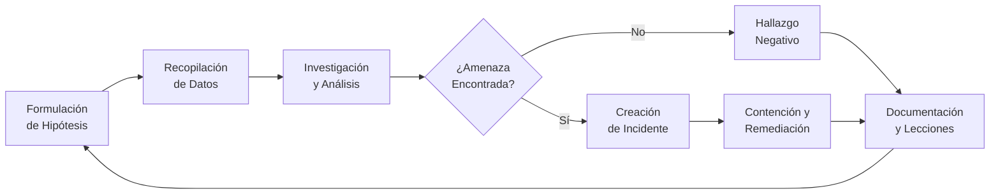
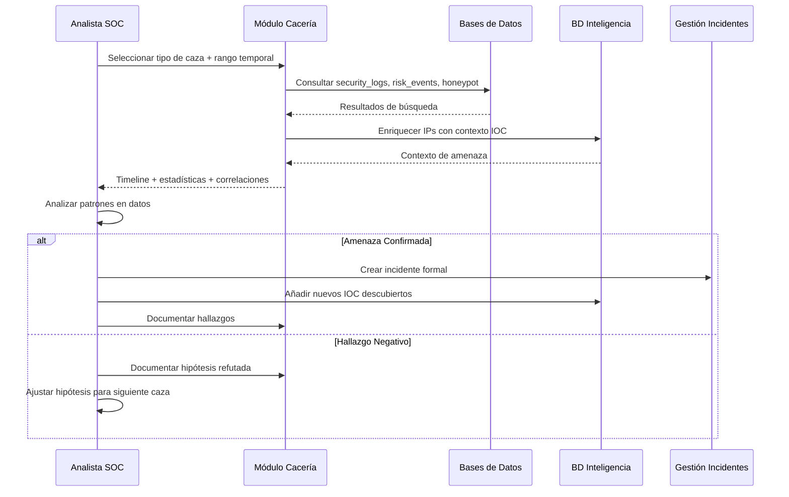

# Cacería de Amenazas — RobenGate Sentinel

> **Clasificación:** INTERNO | **Metodología:** Investigación Orientada por Hipótesis

---

## Resumen Ejecutivo

La Cacería de Amenazas (Threat Hunting) es el **proceso proactivo y orientado por analistas** de búsqueda en datos de seguridad para detectar amenazas que la detección automatizada no ha capturado. A diferencia de las alertas reactivas, la Cacería de Amenazas asume que puede existir ya una brecha en el sistema y valida o refuta sistemáticamente esa hipótesis.

RobenGate Sentinel eleva la Cacería de Amenazas de nivel 1 (alertas automáticas) a nivel 3 (investigación orientada por hipótesis) mediante herramientas de pivote de IOC, plantillas basadas en MITRE ATT&CK, reconstrucción de timelines y una interfaz de consulta de logs flexible. Esto permite a los analistas SOC ir más allá de las alertas conocidas y descubrir amenazas latentes o compromisos en progreso.

---

## 1. Visión General

La Cacería de Amenazas es el **proceso proactivo orientado por analistas** de búsqueda en datos de seguridad para detectar amenazas que la detección automatizada ha pasado por alto. A diferencia de las alertas reactivas, la Cacería de Amenazas asume que puede existir ya una brecha y valida o refuta sistemáticamente esa hipótesis.

RobenGate Sentinel soporta la Cacería de Amenazas mediante:
- **Flujos de trabajo de investigación orientados por hipótesis**
- **Herramientas de pivote de IOC** — buscar todos los eventos relacionados con un indicador específico
- **Plantillas de caza basadas en MITRE ATT&CK**
- **Reconstrucción de timeline** — encadenar eventos relacionados en narrativas de ataque
- **Interfaz de consulta personalizada** — búsqueda de logs flexible con filtros

---

## 2. Metodología de Cacería de Amenazas

### 2.1 Ciclo de Vida de la Caza



### 2.2 Tipos de Caza

| Tipo | Descripción | Ejemplo |
|------|-------------|---------|
| **Orientada por IOC** | Comenzar con indicador conocido, encontrar toda la actividad relacionada | Buscar todos los eventos de la IP `185.220.101.42` |
| **Orientada por TTP** | Comenzar con técnica MITRE, encontrar evidencia de ejecución | Encontrar patrones T1110 en todos los usuarios |
| **Orientada por Hipótesis** | Teoría creada por analista probada contra datos | "¿Se accede a cuentas admin desde IPs compartidas?" |
| **Situacional** | Desencadenada por inteligencia externa (noticias, feeds CTI) | Investigar tras nuevo anuncio de zero-day |

---

## Descripción Técnica

### 3. Interfaz de Cacería de Amenazas (`ThreatHunting.jsx`)

#### 3.1 Espacio de Trabajo de Investigación

```
┌─────────────────────────────────────────────────────────────────┐
│  ESPACIO DE TRABAJO DE CACERÍA DE AMENAZAS                       │
├─────────────────────────────────────────────────────────────────┤
│  Tipo de Caza: [Pivote IOC ▼]    Rango Temporal: [Últimos 7d ▼]│
│                                                                  │
│  IOC: [185.220.101.42         ]  Tipo: [IP ▼]  [CAZAR →]      │
├─────────────────────────────────────────────────────────────────┤
│  RESULTADOS — 47 eventos coincidentes en 3 categorías           │
│                                                                  │
│  EVENTOS AUTH (23)          EVENTOS HONEYPOT (18)  AMENAZAS (6)│
│  ┌─────────────────────┐   ┌──────────────────┐               │
│  │ LOGIN_FAILURE × 23  │   │ SSH_AUTH × 12    │               │
│  │ 2026-05-28 02:14   │   │ HTTP_TRAP × 6    │               │
│  │ hasta 02:47        │   │ 2026-05-28 02:10 │               │
│  └─────────────────────┘   └──────────────────┘               │
│                                                                  │
│  TIMELINE DEL ATAQUE                                             │
│  02:10 — Primer sondeo HTTP honeypot (/.env)                   │
│  02:12 — Fuerza bruta SSH comienza (root, admin, ubuntu...)    │
│  02:14 — Fallo de login: user@objetivo.com                     │
│  02:28 — 10 fallos de login → PROHIBICIÓN AUTOMÁTICA activada │
│  02:47 — Última actividad (prohibición efectiva)               │
│                                                                  │
│  [Crear Incidente]  [Añadir a BD IOC]  [Exportar Timeline]    │
└─────────────────────────────────────────────────────────────────┘
```

#### 3.2 Herramienta de Pivote de IOC

Dado cualquier valor de IOC, la plataforma pivota a través de todas las fuentes de datos:

```javascript
// Backend: GET /api/hunt/pivot?tipo=IP&valor=185.220.101.42
{
  "indicador": { "tipo": "IP", "valor": "185.220.101.42" },
  "fuentes": {
    "security_logs": { "conteo": 47, "mas_antiguo": "...", "mas_reciente": "..." },
    "eventos_honeypot": { "conteo": 18, "detalles": [...] },
    "indicadores_amenaza": { "confianza": 90, "etiquetas": ["tor", "fuerza-bruta"] },
    "historial_prohibicion": { "veces_prohibido": 3, "ultima_prohibicion": "...", "actualmente_prohibido": true },
    "incidentes_asociados": [{ "id": 42, "titulo": "Ataque de Fuerza Bruta desde..." }]
  },
  "timeline": [
    { "timestamp": "...", "tipo": "HONEYPOT_HTTP_PROBE", "ruta": "/.env" },
    { "timestamp": "...", "tipo": "HONEYPOT_SSH_AUTH", "usuario": "root" },
    { "timestamp": "...", "tipo": "LOGIN_FAILURE", "emailUsuario": "user@corp.io" }
  ]
}
```

---

## Arquitectura

### 4. Plantillas de Caza Basadas en MITRE ATT&CK

Plantillas de caza predefinidas basadas en técnicas MITRE ATT&CK:

#### Plantilla de Caza: T1110 — Fuerza Bruta

```
Hipótesis: Un atacante está intentando comprometer cuentas por fuerza bruta

Consulta:
- security_logs DONDE action = 'LOGIN_FAILURE'
- GROUP BY ip_address HAVING COUNT(*) > 5
- DONDE created_at > NOW() - INTERVAL '24 horas'

Falsos positivos esperados:
- Usuarios legítimos con contraseñas olvidadas (máximo 1-3 fallos)
- Mala configuración de gestor de contraseñas (hasta 5 fallos)

Pasos de investigación:
1. Identificar la IP con mayor conteo de fallos
2. Verificar geolocalización de la IP
3. Verificar hits de honeypot desde la misma IP
4. Comprobar si la IP está en AbuseIPDB/inteligencia de amenazas
5. Si confirmado: prohibir IP, crear incidente, buscar logins exitosos
```

#### Plantilla de Caza: T1110.003 — Rociado de Contraseñas

```
Hipótesis: Un atacante está probando contraseñas comunes en muchas cuentas

Consulta:
- security_logs DONDE action = 'LOGIN_FAILURE'
- GROUP BY ip_address
- COUNT(DISTINCT user_email) > 5
- DONDE created_at > NOW() - INTERVAL '1 hora'

Distinción de la fuerza bruta:
- Rociado: muchos usuarios, pocos intentos por cuenta (evita bloqueo por cuenta)
- Fuerza bruta: pocos usuarios, muchos intentos por cuenta

Pasos de investigación:
1. Identificar patrón de rociado (bajos intentos por cuenta)
2. Comprobar si los usuarios objetivo son de alto privilegio (admin, ejecutivo)
3. Verificar timing: fuera de horario aumenta la confianza
4. Buscar logins exitosos justo después del rociado
```

#### Plantilla de Caza: T1190 — Explotación de Aplicación Pública

```
Hipótesis: Un atacante está sondeando vulnerabilidades de la aplicación web

Consulta:
- security_logs DONDE action EN ('XSS_BLOCKED', 'SQLI_BLOCKED')
- O action = 'ATTACK_PATTERN_SUSPICIOUS'
- DONDE created_at > NOW() - INTERVAL '4 horas'

Pasos de investigación:
1. Verificar endpoints atacados (/api/auth/login es el objetivo #1)
2. Examinar metadata de payloads para nivel de sofisticación
3. Comprobar si la misma IP también golpeó el honeypot (reconocimiento primero)
4. Correlacionar con solicitudes exitosas después de intentos bloqueados
```

#### Plantilla de Caza: Viaje Imposible

```
Hipótesis: Una cuenta legítima ha sido comprometida

Consulta:
- risk_events DONDE signals::jsonb ? 'viaje_imposible'
- DONDE created_at > NOW() - INTERVAL '24 horas'

Pasos de investigación:
1. Identificar la cuenta del usuario
2. Confirmar que el viaje es imposible (verificar timestamps + distancia geo)
3. Revisar todas las acciones realizadas después del login anómalo
4. Contactar al usuario por canal secundario para confirmar
5. Si brecha confirmada: revocar todas las sesiones, forzar restablecimiento de contraseña
```

---

## Flujo Operacional

### 5. Flujo de Trabajo de Investigación



---

## Casos de Uso

### Caso 1: Caza de APT Latente

**Hipótesis**: "¿Hay actividad de movimiento lateral que no haya generado alertas?"

El analista crea una consulta personalizada buscando logins exitosos desde IPs que también hayan tenido hits de honeypot. Descubre que una IP tenía 3 hits de honeypot hace 48h y posteriormente realizó un login exitoso. El acceso pasó por debajo del umbral de correlación automática. El analista crea un incidente crítico y revoca la sesión comprometida.

### Caso 2: Validación de Inteligencia de Amenazas Externa

**Hipótesis**: "¿Están presentes en nuestra plataforma los IOC de la nueva campaña APT-41?"

El analista importa los IOC del reporte CTI externo y usa el pivote de IOC para buscar coincidencias históricas. Encuentra 2 IPs del reporte que habían golpeado el honeypot HTTP hace 72h. Aunque no hubo compromiso, documenta el reconocimiento y actualiza la confianza de los IOC.

---

## 6. Interfaz de Consulta de Logs

Los analistas pueden construir consultas personalizadas con los siguientes filtros:

| Filtro | Opciones | Ejemplo |
|--------|---------|---------|
| Rango temporal | 1h, 4h, 24h, 7d, 30d, personalizado | Últimos 7 días |
| Categoría | AUTH, ACCESS, THREAT, HONEYPOT, ADMIN, DATA, SYSTEM | Solo THREAT |
| Acción | Lista completa de acciones | XSS_BLOCKED |
| Severidad | CRITICAL, HIGH, MEDIUM, LOW, INFO | HIGH+ |
| Dirección IP | Exacta, rango CIDR | 185.220.0.0/16 |
| País | Código ISO 3166-1 | RU, CN, KP |

---

## Beneficios para una Empresa

| Beneficio | Descripción |
|-----------|-------------|
| **Detección de Amenazas Avanzadas** | Descubre compromisos que evaden la detección automática |
| **Reducción del Tiempo de Exposición** | Identifica brechas latentes antes de que sean explotadas completamente |
| **Mejora Continua** | Los hallazgos negativos refinan las hipótesis y mejoran las reglas |
| **Cumplimiento** | Evidencia de monitorización proactiva para auditorías |
| **Desarrollo de Analistas** | Las plantillas MITRE ATT&CK educan al equipo SOC |

---

## Seguridad

- **Aislamiento de consultas**: Todas las consultas se ejecutan con permisos de solo lectura
- **Límite de resultados**: Las consultas están acotadas para prevenir exfiltración masiva de datos
- **Auditoría**: Cada sesión de caza se registra para supervisión
- **Control de acceso**: Solo Analyst+ puede ejecutar cazas activas

---

## Integraciones

- **Inteligencia de Amenazas** — Enriquecimiento automático de IOC en resultados de caza
- **Gestión de Incidentes** — Un clic para crear incidente desde resultado de caza
- **Sistema de Auditoría** — Logs de todas las consultas de caza para cumplimiento
- **Motor de Correlación** — Los hallazgos de caza pueden convertirse en nuevas reglas de correlación

---

## Roadmap

| Capacidad | Estado |
|-----------|--------|
| **Editor visual de consultas** | Planificado |
| **Biblioteca de plantillas de caza expandida** | Planificado |
| **Caza asistida por IA** (sugerencias de hipótesis) | Futuro |
| **Programación de cacerías automáticas** | Futuro |
| **Colaboración en tiempo real** (múltiples analistas) | Futuro |

---

*Ver también: [../siem/resumen.md](../siem/resumen.md) | [../threat-intelligence/resumen.md](../threat-intelligence/resumen.md) | [../audit-system/resumen.md](../audit-system/resumen.md)*
