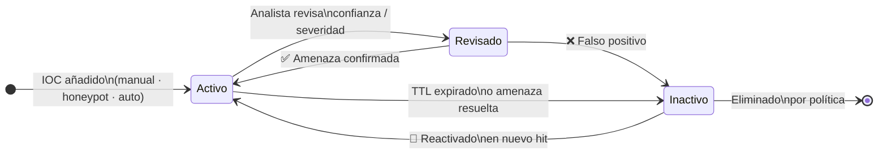
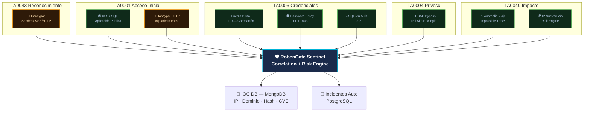
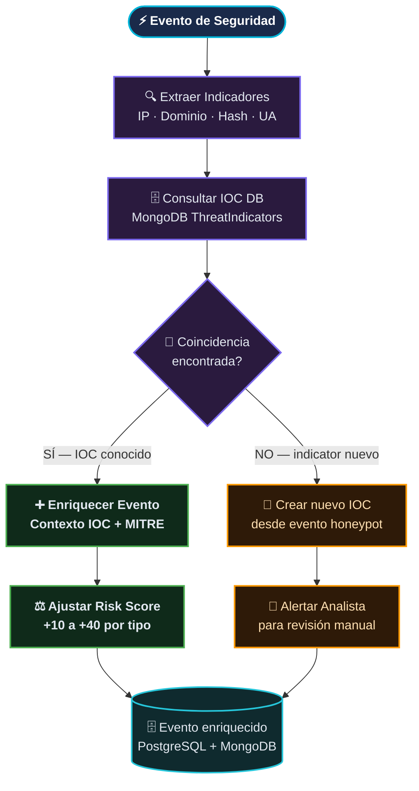

# Inteligencia de Amenazas — RobenGate Sentinel

> **Clasificación:** INTERNO | **Marco:** MITRE ATT&CK

---

## Resumen Ejecutivo

El módulo de Inteligencia de Amenazas de RobenGate Sentinel proporciona **gestión de Indicadores de Compromiso (IOC), mapeo al marco MITRE ATT&CK, perfilado de actores de amenaza y agregación de fuentes de inteligencia**. Funciona como la base de conocimiento que enriquece los eventos de seguridad con contexto de amenazas y permite a los analistas correlacionar ataques actuales con TTPs (Tácticas, Técnicas y Procedimientos) conocidos de actores de amenaza.

La plataforma soporta 8 tipos de IOC, incluyendo direcciones IP, dominios, hashes de archivos, URLs maliciosas, identificadores CVE y agentes de usuario maliciosos, con un pipeline de enriquecimiento automatizado que conecta los IOC con todos los eventos de seguridad del sistema.

---

## 1. Visión General

El módulo de Inteligencia de Amenazas proporciona **gestión de Indicadores de Compromiso (IOC)**, mapeo a MITRE ATT&CK, perfilado de actores de amenaza y agregación de fuentes de información. Sirve como base de conocimiento que enriquece los eventos de seguridad con datos de amenazas contextuales y permite a los analistas correlacionar ataques actuales con TTPs conocidos.

---

## 2. Gestión de IOC (Indicadores de Compromiso)

### 2.1 Tipos de IOC Soportados

| Tipo | Descripción | Ejemplo |
|------|-------------|---------|
| `IP` | Dirección IP (IPv4/IPv6) | `185.220.101.42` |
| `DOMINIO` | Dominio malicioso | `malware.example.ru` |
| `HASH_MD5` | Hash de archivo MD5 | `d41d8cd98f00b204e9800998ecf8427e` |
| `HASH_SHA256` | Hash de archivo SHA-256 | `e3b0c44298fc...` |
| `URL` | URL maliciosa | `http://malicioso.ru/payload.exe` |
| `EMAIL` | Remitente de phishing | `admin@empresa-falsa.ru` |
| `CVE` | ID de vulnerabilidad | `CVE-2024-12345` |
| `AGENTE_USUARIO` | Agente de usuario malicioso | `Masscan/1.0 tbot` |

### 2.2 Esquema de IOC

```javascript
{
  tipo:           'IP' | 'DOMINIO' | 'HASH_MD5' | 'HASH_SHA256' | 'URL' | 'EMAIL' | 'CVE' | 'AGENTE_USUARIO',
  valor:          String,          // El valor del IOC (único por tipo)
  confianza:      Number,          // Puntuación de confianza 0-100
  severidad:      'LOW' | 'MEDIUM' | 'HIGH' | 'CRITICAL',
  fuente:         String,          // honeypot | virustotal | manual | nombre_fuente
  descripcion:    String,          // Contexto legible por humanos
  etiquetas:      [String],        // Etiquetas de clasificación
  primerVisto:    Date,            // Marca temporal de primera observación
  ultimoVisto:    Date,            // Observación más reciente
  contadorHits:   Number,          // Conteo total de detecciones
  activo:         Boolean,         // Actualmente monitoreado
  taticaMitre:    String,          // Nombre de táctica MITRE ATT&CK
  tecnicaMitre:   String,          // ID de técnica MITRE ATT&CK
  pais:           String,          // Atribución geográfica (para IPs)
  asn:            String,          // Número de Sistema Autónomo
  agregadoPor:    String,          // Analista que lo añadió
  revisadoPor:    String,          // Analista que lo revisó
}
```

### 2.3 Ciclo de Vida del IOC



---

## Arquitectura

### 3. Integración con MITRE ATT&CK

#### 3.1 Cobertura de Tácticas

RobenGate Sentinel mapea eventos de seguridad a tácticas MITRE ATT&CK usando los campos `mitreTactic` y `mitreTechnique` del evento:


        DET4[Fuerza bruta → TA0006/T1110]
        DET5[Rociado credenciales → TA0006/T1110.003]
        DET6[Traversal de rutas → TA0007]
        DET7[Inyección null-byte → TA0005]
    end
```

#### 3.2 Mapeo Técnica-Detección

| Técnica MITRE | ID | Detectado Por | Regla |
|--------------|-----|--------------|-------|
| Fuerza Bruta | T1110 | Motor de Correlación | ≥5 LOGIN_FAILURE/IP/10min |
| Rociado de Contraseñas | T1110.003 | Motor de Correlación | ≥10 fallos/≥5 usuarios/15min |
| Explotación de Aplicación Pública | T1190 | Detección de Ataques | Coincidencia XSS/SQLi |
| Inyección de Comandos OS | T1059.004 | Detección de Ataques | Patrones de metacaracteres shell |
| Phishing (recolección de credenciales) | T1566 | Honeypot HTTP | Trampas `/wp-admin`, `/login` |
| Abuso de Cuenta Válida | T1078 | Motor de Riesgo | Viaje imposible, puntuación anomalía |
| Escaneo de Servicios de Red | T1046 | Honeypot | Patrones de sondeo de puertos |
| Volcado de Credenciales | T1003 | Detección de Ataques | Patrones SQLi en endpoints auth |

---

## Flujo Operacional

### 4. Pipeline de Enriquecimiento de IOC



---

## 5. Panel de Inteligencia de Amenazas

### 5.1 Características del Panel (`ThreatIntelligence.jsx`)

**Tarjetas de Resumen IOC:**
- Total de indicadores activos
- Conteo de IOC críticos
- Indicadores añadidos en las últimas 24h
- Distribución de IOC por tipo (gráfico circular)

**Gráfico de Tendencia 7 Días:**
- Gráfico de área apilada de nuevos IOC por severidad a lo largo del tiempo
- Permite a los analistas detectar picos de inteligencia de amenazas

**Tabla de IOC:**
- Filtrable por tipo, severidad, fuente
- Ordenable por confianza, último visto, conteo de hits
- Insignias de táctica/técnica MITRE ATT&CK en línea
- Reporte con un clic para indicadores sospechosos

**Sección de Actores de Amenaza (datos curados):**
- Grupos APT conocidos con resúmenes de TTP
- Marcas temporales de último visto
- Lista de técnicas asociadas

### 5.2 Actores de Amenaza Conocidos (Curados)

| Actor | Región | Tácticas Principales | TTPs Notables |
|-------|--------|---------------------|---------------|
| **APT-29** (Cozy Bear) | Rusia | Acceso Inicial, Persistencia, Acceso a Credenciales | T1190, T1566.002, T1110 |
| **Grupo Lazarus** | Corea del Norte | Acceso Inicial, Recopilación, Impacto | T1190, T1059, T1485 |
| **APT-41** | China | Acceso Inicial, Ejecución, Exfiltración | T1190, T1059.007, T1041 |
| **FIN7** | Europa del Este | Acceso Inicial, Acceso a Credenciales, Exfiltración | T1566, T1555, T1041 |
| **Sandworm** | Rusia | Ejecución, Impacto, Evasión de Defensas | T1059, T1485, T1562 |

---

## Casos de Uso

### Caso 1: Detección Proactiva de Amenaza

Un analista nota un IOC de tipo IP con 142 hits en 24h desde Rusia. Al revisar el contexto MITRE ATT&CK (T1190 - Explotación de Aplicación Pública), correlaciona con ataques XSS bloqueados recientes. Crea un incidente formal, añade el IOC como CRÍTICO y activa monitorización reforzada.

### Caso 2: Respuesta a Feed de Amenazas

El equipo de seguridad recibe un informe externo sobre una campaña APT-29 activa. El analista añade manualmente los IOC de la campaña (IPs, dominios, hashes) al módulo. Los eventos futuros que coincidan con estos IOC automáticamente recibirán mayor puntuación de riesgo y alertas priorizadas.

### Caso 3: Investigación de Compromiso

Post-incidente, el analista usa el módulo para identificar todos los IOC generados durante el ataque, exporta la lista para compartir con el equipo CSIRT y actualiza la confianza de cada IOC basándose en la investigación forense.

---

## 6. API de Inteligencia de Amenazas

### 6.1 Endpoints

| Método | Endpoint | Auth | Descripción |
|--------|----------|------|-------------|
| `GET` | `/api/threats/indicators` | viewer+ | Listar IOC con paginación + filtros |
| `GET` | `/api/threats/stats` | viewer+ | Estadísticas IOC por severidad/tipo |
| `GET` | `/api/threats/feeds` | viewer+ | Resumen de fuentes de feed |
| `GET` | `/api/threats/heatmap` | viewer+ | Mapa de calor geo de indicadores IP |
| `POST` | `/api/threats/report` | analyst+ | Enviar nuevo IOC |

### 6.2 Solicitud de Reporte de IOC

```http
POST /api/threats/report
Authorization: Bearer {token}
Content-Type: application/json

{
  "tipo": "IP",
  "valor": "185.220.101.42",
  "confianza": 90,
  "severidad": "HIGH",
  "descripcion": "Nodo de salida Tor conocido, múltiples hits en honeypot",
  "etiquetas": ["tor", "fuerza-bruta", "proxy"],
  "taticaMitre": "Acceso Inicial",
  "tecnicaMitre": "T1190"
}
```

### 6.3 Consulta IOC con Filtros

```http
GET /api/threats/indicators?tipo=IP&severidad=HIGH&activo=true&pagina=1&limite=50
Authorization: Bearer {token}
```

---

## Beneficios para una Empresa

| Beneficio | Valor |
|-----------|-------|
| **Reducción del Tiempo de Respuesta** | IOC activos automáticamente elevan el riesgo de eventos coincidentes |
| **Contexto MITRE ATT&CK** | Cada ataque mapea a TTPs conocidos para mejor comprensión |
| **Inteligencia Compartible** | Formato estructurado facilita compartir con CSIRT y socios |
| **Historial de Amenazas** | Base de conocimiento acumulativa mejora detección con el tiempo |

---

## Seguridad

- **Validación de IOC**: Todos los valores son validados según su tipo antes de inserción
- **Inmutabilidad**: Los IOC no pueden modificarse tras revisión sin auditoría
- **Control de Acceso**: Viewers pueden leer, solo Analyst+ puede crear IOC
- **Sanitización**: Todos los campos de texto pasan por sanitización antes de almacenamiento

---

## Integraciones

- **Motor de Correlación** — IOC activos alimentan reglas de detección
- **Motor de Riesgo** — IPs en lista negra se marcan como IOC automáticamente
- **Sistema de Auditoría** — Cada creación/modificación de IOC se audita
- **Módulo Honeypot** — Los hits de honeypot auto-generan IOC de tipo IP
- **Caza de Amenazas** — Pivot de IOC para investigación forense

---

## Roadmap

| Capacidad | Estado |
|-----------|--------|
| **Integración AbuseIPDB** | Planificado |
| **Integración VirusTotal** | Planificado |
| **Feeds TAXII/STIX** | Futuro |
| **Puntuación automática de confianza con ML** | Futuro |
| **Exportación STIX 2.1** | Futuro |

---

*Ver también: [../siem/resumen.md](../siem/resumen.md) | [../threat-hunting/resumen.md](../threat-hunting/resumen.md) | [../honeypot/resumen.md](../honeypot/resumen.md)*
